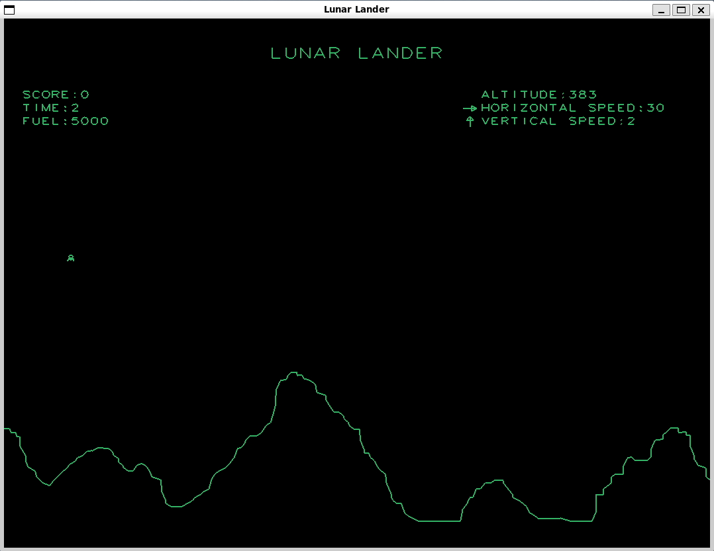
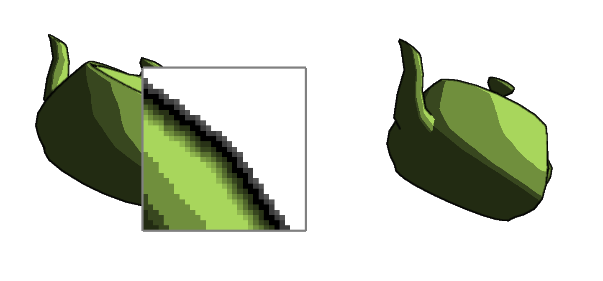
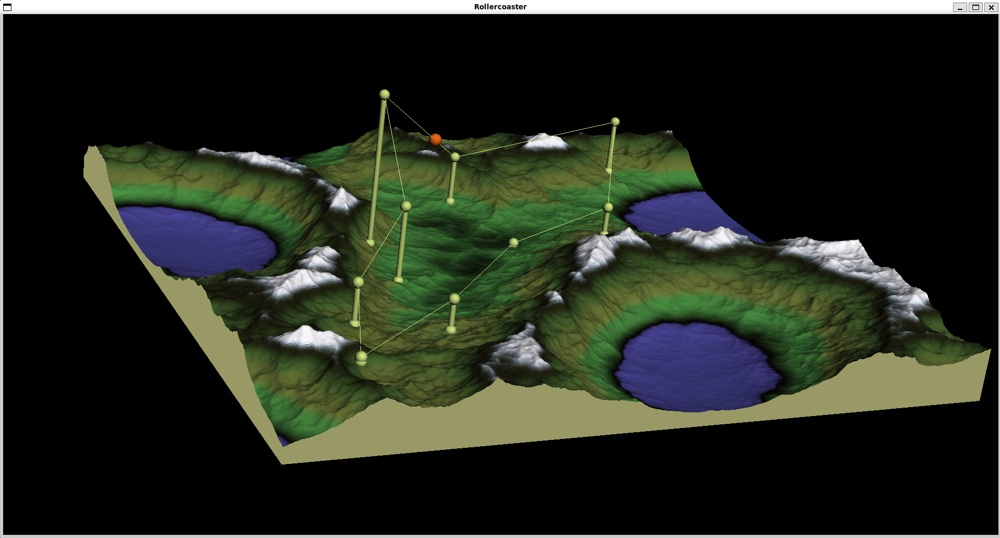

# CMPE 454: Computer Graphics

A series of C++ simulations and rendering pipelines built with OpenGL and GLSL, covering real-time physics, multi-pass deferred rendering, and 3D spline-driven animation.

## Technologies

- **Language**: C++17
- **Graphics API**: OpenGL 3.3 / OpenGL ES 3.0
- **Shader language**: GLSL 3.00 ES
- **Windowing / input**: GLFW3
- **Image loading**: LodePNG (A3), FreeType (A2/A3 text rendering)
- **Build**: GNU Make (Linux/macOS), MSVC (Windows)


## Assignment 1: Lunar Lander

A real-time 2D physics simulation of the classic Lunar Lander game, rendered with OpenGL.



### Object-Oriented Design

The simulation is decomposed into three classes with clear, single-responsibility boundaries:

| Class | Responsibility |
|---|---|
| `World` | Top-level game loop owns `Landscape` and `Lander` pointers, drives `updateState()` and `draw()`, manages score and timing |
| `Lander` | Encapsulates all lander state (position, velocity, orientation, fuel) and its VAO/VBO GPU resources |
| `Landscape` | Encapsulates terrain geometry and all collision/proximity queries against it |

`World` acts as an aggregate root: it holds raw pointers to `Landscape` and `Lander`, delegating rendering and physics to each, while remaining the sole arbiter of game state transitions (landing vs. crash).

### Data Structures

- **Flat `float[]` vertex arrays** both `Lander::landerVerts[]` and `Landscape::landscapeVerts[]` are static sentinel-terminated arrays (`-1` marks the end). Iterating with a stride of 2 gives (x, y) pairs, keeping geometry data contiguous for GPU upload.
- **VAO / VBO** (`GLuint`) each renderable object allocates its own Vertex Array Object and Vertex Buffer Object. `setupVAO()` normalizes model-space coordinates into world space in-place, then uploads once to the GPU; subsequent frames only bind the VAO and call `glDrawArrays`.
- **Custom linear algebra types** (`vec3`, `vec4`, `mat4` from `linalg.h`) operator-overloaded value types supporting dot product (`*`), cross product (`^`), scalar multiplication, and `mat4` composition, forming the backbone of all transform computations.

### Algorithms

**Closest-point on segment** (`Landscape::findClosestPoint`):
Projects a point onto the infinite line through `segTail` and `segHead` using the dot product of the normalized direction vector, then clamps the scalar parameter `t` to `[0, length]` to stay within the segment. Used every frame to find the nearest terrain point for zoom-view activation and collision detection.

**Ground-height lookup** (`Landscape::GroundUnder` + `World::Altitude`):
A linear scan over all landscape segments finds the one whose x-interval brackets the lander's x-position. The terrain y-value directly below the lander is then recovered by linear interpolation along that segment: `y = StartY + (EndY - StartY) * (landerX - StartX) / (EndX - StartX)`. Altitude subtracts `lander->height / 2` to measure from the lander's bottom edge.

**Physics integration** (`Lander::updatePose`):
First-order Euler integration updates position and orientation each frame:
```
position    += deltaT * velocity
orientation += deltaT * angularVelocity
velocity    += deltaT * GRAVITY      // (0, -1.6, 0) m/s²
```
Thrust adds to velocity in the direction of the current orientation angle:
```
velocity.x -= THRUST_ACCEL * sin(orientation) * deltaT
velocity.y += THRUST_ACCEL * cos(orientation) * deltaT
```
Fuel decreases proportionally to thrust type (main vs. rotational).

**Transform pipeline** (`Lander::draw`):
The full MVP matrix is composed by right-multiplying: `worldToView * translate(position) * rotate(orientation, z-axis)`. The lander is stored centered at the origin, so the rotation is applied before the world translation.

**Adaptive zoom transform** (`World::draw`):
When the lander is within `ZOOM_RADIUS` of the terrain, the world-to-view matrix switches to a scale centered on the lander's world position, providing a close-up view for landing.

**Landing score** (`World::updateState`):
A composite score is computed as a weighted sum of three normalized criteria: horizontal speed, vertical speed, and remaining fuel, each contributing one-third of a possible 1000 points.



---

## Assignment 2: Non-Photorealistic Rendering (Deferred Shading)

A three-pass GPU rendering pipeline implementing cel shading and wide black silhouettes on a 3D mesh, written in GLSL with a C++ host.

### Object-Oriented Design

| Class | Responsibility |
|---|---|
| `GBuffer` | Owns the OpenGL FBO and a dynamically-allocated `GLuint[]` texture array; exposes `BindForWriting()`, `BindForReading()`, `BindTexture(i)`, and `setDrawBuffers()` to manage per-pass attachment configuration |
| `Renderer` | Orchestrates the three-pass pipeline; owns four `GPUProgram*` shader programs and a `GBuffer*`; the `render()` method sequences pass activation, uniform uploads, and draw calls |
| `GPUProgram` | Wraps GLSL shader compilation, linking, and uniform location caching |

`Renderer` manages RAII lifetimes: the destructor explicitly deletes all four `GPUProgram` pointers and the `GBuffer` pointer in reverse construction order, preventing GPU resource leaks.

### Data Structures

- **G-buffer texture array** (`GLuint *textures`, heap-allocated in `GBuffer`): four `GL_RGB16F` floating-point textures (colour, normal, depth, Laplacian), each matching framebuffer resolution, attached to consecutive `GL_COLOR_ATTACHMENT` slots. An additional `GL_DEPTH_COMPONENT32F` texture handles depth testing.
- **Draw buffer reconfiguration** (`GLenum[]`): a small stack-allocated array remaps which colour attachments are active for each pass via `glDrawBuffers`, allowing pass 1 to write all four textures simultaneously and passes 2–3 to write only the Laplacian.
- **Enum `{ COLOUR_GBUFFER, NORMAL_GBUFFER, DEPTH_GBUFFER, LAPLACIAN_GBUFFER }`**: integer indices used as texture unit and attachment offsets, keeping the four channels symbolically named throughout the pipeline.

### Algorithms

**Pass 1: Geometry to G-buffer** (`pass1.vert`):
Transforms vertex normals into View Coordinate Space with `MV * vec4(normal, 0)` (w=0 excludes translation). Encodes NDC depth into `[0, 1]` via `(gl_Position.z / gl_Position.w + 1) / 2`. Outputs colour, VCS normal, and depth to three texture attachments simultaneously.

**Pass 2: Laplacian edge detection** (`pass2.frag`):
Applies a 3×3 discrete Laplacian kernel to the depth texture:
```
weights:  -1 -1 -1
          -1  8 -1
          -1 -1 -1
```
Each of the eight neighbours is sampled using `texCoordInc` (the texel size in UV space) and accumulated with one `texture()` lookup each. The signed Laplacian is stored directly. Large negative values mark depth discontinuities (silhouette edges).

**Pass 3: Cel shading + silhouette blending** (`pass3.frag`):
- **Early discard**: background fragments with no nearby edge are discarded before any expensive lookups.
- **Cel shading**: diffuse intensity `NdotL = dot(normal, lightDir)` is quantized to `numQuanta` discrete steps via `ceil(numQuanta * NdotL) / numQuanta`, floored at 0.2 for ambient.
- **Silhouette blending**: a `kernelRadius × kernelRadius` neighbourhood is scanned for fragments whose Laplacian exceeds a threshold. The distance to the closest such edge fragment is computed; the ratio `closestDist / maxDist` is used as a blend factor that transitions smoothly from solid black (at the edge) to the full cel-shaded colour (at `kernelRadius` pixels away).

---

## Assignment 3: Roller Coaster Simulator

An interactive 3D roller coaster simulator with spline track evaluation, energy-based physics, procedural heightfield terrain, and an arcball camera.



### Object-Oriented Design

| Class | Responsibility |
|---|---|
| `Scene` | Root scene graph: owns `Terrain*`, `Spline*`, `CtrlPoints*`, `Train*`, `Arcball*`; handles all GLFW input callbacks via C++ lambdas and routes to member functions |
| `Spline` | Evaluates cubic splines (linear, Catmull-Rom, B-spline) at arbitrary parameters; maintains arc-length lookup table and exposes a uniform `eval(t, type)` interface |
| `Train` | Tracks position on the spline as a scalar arc-length value; calls `spline->paramAtArcLength(pos)` and `spline->findLocalSystem()` to position and orient itself |
| `Terrain` | Reads a PNG heightfield into a 2D `vec3 **points` grid, constructs a VAO-backed triangle mesh, and provides `findIntPoint()` for mouse-ray intersection |
| `CtrlPoints` | Manages a `seq<vec3>` of control point positions with add/delete/move operations tied to mouse picking |
| `Arcball` | Implements quaternion-based camera rotation from mouse drag events |
| `seq<T>` | Custom generic dynamic array (template class) used as the control-point container |

### Data Structures

**`seq<T>` Templated dynamic array** (`seq.h`):
A custom resizable array implementing the same interface as `std::vector`. Storage doubles when capacity is exhausted:
```cpp
if (numElements == storageSize) {
    T *newData = new T[ storageSize * 2 ];
    // copy elements, update storageSize, delete old storage
}
```
Supports `add`, `remove(i)` (O(n) left-shift), `shift(i)` (O(n) right-shift), `operator[]` with bounds checking, copy constructor, and assignment operator. Used to store `vec3` control points and terrain quad highlight lists.

**Arc-length table** (`float *arcLength`):
A flat heap-allocated array of `N * DIVS_PER_SEG + 1` entries where `arcLength[i]` is the cumulative arc length up to the i-th sample. Built once (lazily, invalidated on control point change) by summing Euclidean chord lengths between consecutive spline samples.

**Change-of-basis matrix array** (`static float M[][4][4]`):
A static 3D array encoding three 4×4 spline basis matrices (linear, Catmull-Rom, B-spline). `currSpline` indexes into the first dimension; `nextCOB()` cycles through them. Avoids heap allocation for data that never changes.

**Terrain heightfield** (`vec3 **points`, `vec3 **normals`):
A 2D array of world-space vertex positions and normals derived from a PNG heightfield image. Each pixel's intensity drives the z-coordinate. Triangle fan connectivity is built procedurally into the VAO.

### Algorithms

**Spline evaluation** (`Spline::eval`):
For parameter `t`, the segment index is `q = floor(t)` and the local parameter is `u = t - q`. Four control points `q[-1], q[0], q[1], q[2]` are assembled into a `mat4` column matrix `V`. The basis matrix `M[currSpline]` is multiplied by `V` to produce the coefficient matrix `Mv`. Then:
- Value: `Mv[0]*u³ + Mv[1]*u² + Mv[2]*u + Mv[3]`
- Tangent: `3*Mv[0]*u² + 2*Mv[1]*u + Mv[2]`

Cyclic wrapping (`q_idx % data.size()`) ensures continuity across the loop endpoint.

**Arc-length parameterization** (`Spline::paramAtArcLength`):
Converts a desired arc length `s` to a spline parameter `t` using **binary search** on the precomputed `arcLength[]` table — O(log N) per query. Linear interpolation within the located interval gives sub-sample precision.

**Local coordinate frame** (`Spline::findLocalSystem`):
At each point on the track, an orthonormal frame (origin `o`, axes `x`, `y`, `z`) is derived from the spline tangent. The forward axis `z` is the normalized tangent. The up axis `y` is constructed to point as vertically as possible without being parallel to `z`, then `x = -(y × z)` completes the right-handed frame. This frame drives both track geometry rendering and train orientation.

**Ray–terrain intersection** (`Terrain::findIntPoint`):
Tests the mouse ray against every triangle in the heightfield mesh using the Möller–Trumbore algorithm (`rayTriangleInt`), enabling interactive placement of control points by clicking directly on the terrain surface.

**Arcball rotation** (`Arcball`):
Mouse drag events are mapped to rotations on a virtual sphere. The rotation is accumulated as a quaternion, converted to a `mat4` view matrix each frame, avoiding gimbal lock inherent in Euler angle representations.