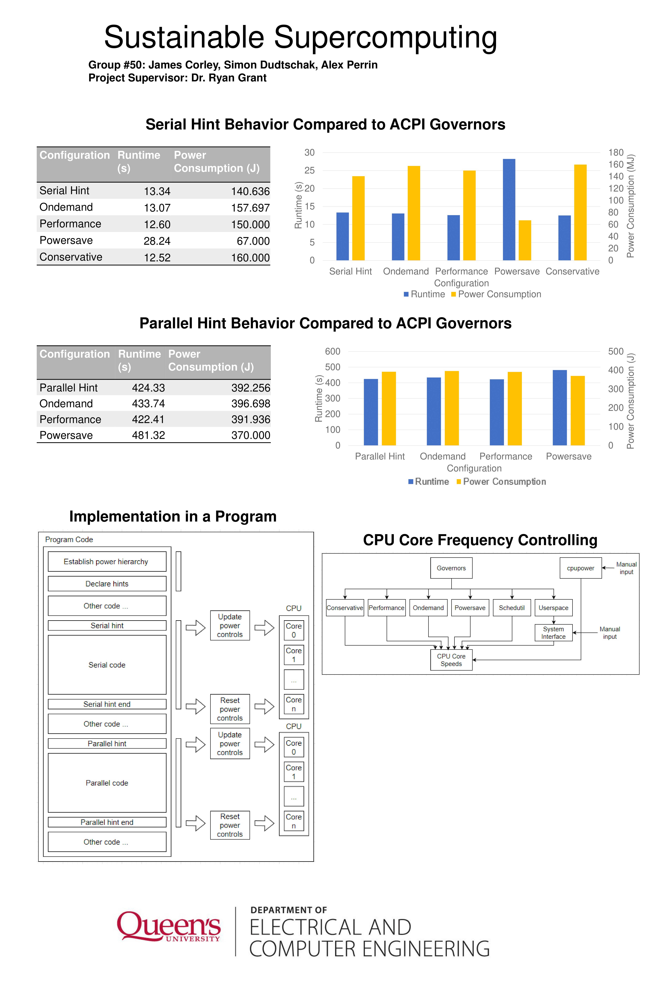
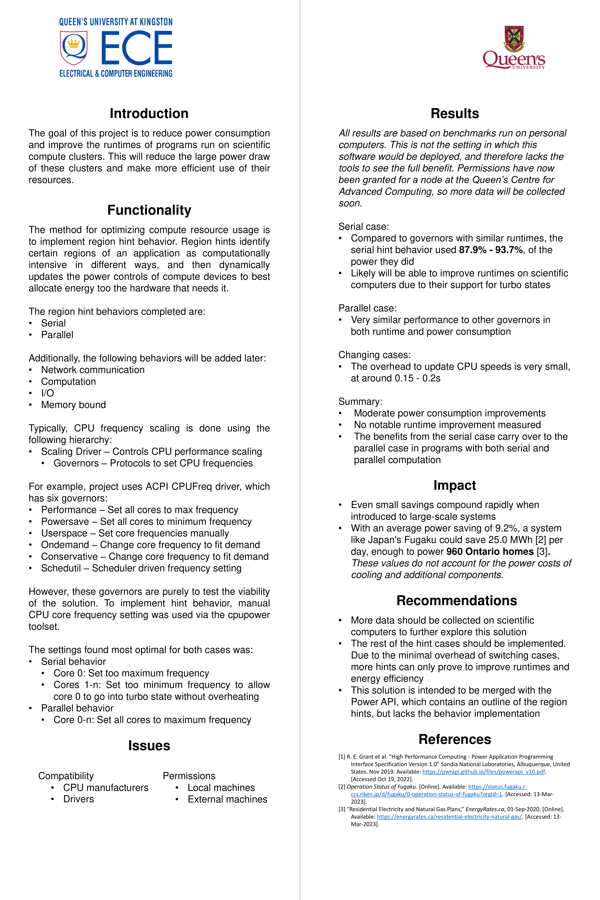

# Sustainable Supercomputing: Power Controls for HPC Efficiency

**ELEC 490/498 Capstone Project - Queen's University**

*Designing and implementing a comprehensive testing framework for dynamic CPU frequency scaling in high-performance computing systems*

## Project Overview

This project involved the **design, implementation, and validation** of a complete power control system for High-Performance Computing (HPC) environments. The core challenge was creating a robust testing suite and API implementation that could reliably control CPU frequencies across different workload patterns while accurately measuring performance and energy metrics.

Through iterative development of custom benchmarks and power control scripts, we achieved an **average 6.5% reduction in runtime** and **9.4% reduction in energy consumption**. The work is intended to contribute to the [Power API](http://powerapi.sandia.gov/), a community-led tool for power monitoring and control in HPC systems.

## Team Members

- James Corley
- Simon Dudtschak
- Alex Perrin

**Supervisors:** Dr. Ryan Grant, Dr. Sean Whitehall

## Technical Implementation

### System Architecture

We developed a complete control and measurement pipeline operating at the Linux kernel level:

```
User Space (Benchmarks) 
    ↓
Region Hint Implementation (Bash Scripts)
    ↓
CPUpower Toolset / sysfs Interfaces
    ↓
Kernel Space (CPU Frequency Scaling Drivers)
    ↓
Hardware (Intel Xeon CPU Cores)
```

### Custom Testing Suite Development

One of the project's core achievements was designing and implementing five specialized benchmarks to stress different computational patterns:

#### 1. **Serial Benchmark**
```c
// Designed to test single-core performance optimization
for (int i = 0; i < ITERATIONS; i++) {
    for (int j = 0; j < INNER_LOOP; j++) {
        computation_variable += operation(i, j);
    }
}
```

#### 2. **Parallel Benchmark** 
```c
// OpenMP-based shared memory parallelization
#pragma omp parallel for reduction(+:sum)
for (int i = 0; i < ARRAY_SIZE; i++) {
    sum += compute_intensive_operation(array[i]);
}
```

#### 3. **Memory-Bound Benchmark**
- Dynamic array allocation and reallocation
- Memory-intensive copy operations
- Designed to make memory subsystem the bottleneck

#### 4. **I/O Benchmark**
- Large file read/write operations
- External storage stress testing
- I/O subsystem bottleneck simulation

#### 5. **Network Communication Benchmark**
- High-volume HTTP requests using curl
- Network latency and bandwidth testing
- Simulates distributed computing communication patterns

### Power Control API Implementation

#### Low-Level System Interface

We implemented direct control over CPU frequency scaling through Linux sysfs:

```bash
/sys/devices/system/cpu/cpu*/cpufreq/
├── scaling_driver           # Driver identification
├── scaling_available_governors
├── scaling_governor         # Governor control
├── scaling_setspeed        # Direct frequency control (CPUfreq)
├── scaling_max_freq        # Maximum frequency bounds
├── scaling_min_freq        # Minimum frequency bounds
└── scaling_cur_freq        # Current frequency monitoring
```

#### Driver Compatibility Layer

Successfully implemented support for multiple CPU scaling architectures:

- **intel_pstate**: Modern Intel CPUs with hardware P-states
  - Frequency control via min/max bounds
  - P-state range management
  
- **CPUfreq** (acpi_cpufreq/intel_cpufreq): Legacy and compatibility mode
  - Direct frequency setting capability
  - Broader hardware support

#### Automated Testing Framework

Developed comprehensive bash scripts that:
1. Save current CPU state and power settings
2. Apply specific frequency scaling behaviors
3. Execute benchmarks with precise timing
4. Collect power consumption data via RAPL interfaces
5. Restore original CPU state (fail-safe design)

```bash
# Example hint implementation workflow
save_cpu_state()
apply_hint_behavior()
execute_benchmark()
collect_metrics()
restore_cpu_state()
```

## Implementation Challenges & Solutions

### Challenge 1: Permission Management
**Problem**: HPC clusters restrict direct hardware access for safety  
**Solution**: Coordinated with CAC to obtain reserved node with elevated permissions; implemented safe state restoration

### Challenge 2: Hardware Abstraction
**Problem**: Different CPU architectures have varying control mechanisms  
**Solution**: Developed driver detection and abstraction layer supporting both intel_pstate and CPUfreq

### Challenge 3: Measurement Precision
**Problem**: Needed sub-second energy measurements without impacting performance  
**Solution**: Leveraged RAPL (Running Average Power Limit) hardware counters for low-overhead monitoring

### Challenge 4: Governor Interference
**Problem**: System governors would override manual frequency settings  
**Solution**: Implemented userspace governor mode with explicit control handoff

## Region Hint Behaviors - Implementation Details

### Serial Hint Implementation
```bash
# Maximize single core, minimize others
cpupower -c 0 frequency-set -d 2.7GHz -u 3.0GHz
cpupower -c 1-23 frequency-set -d 1.2GHz -u 1.3GHz
```
**Result**: 38.9% energy reduction

### Parallel Hint Implementation
```bash
# Increase minimum frequency across all cores
cpupower -c 0-23 frequency-set -d 2.5GHz -u 3.0GHz
```
**Result**: Optimized for consistent multi-core performance

### Memory Bound Hint Implementation
```bash
# Reduce CPU frequency when memory is bottleneck
cpupower -c 0-23 frequency-set -d 1.8GHz -u 2.0GHz
```
**Result**: 4% energy reduction without runtime penalty

### Network Communication Hint Implementation
```bash
# Boost one core for network handling, minimize others
cpupower -c 0 frequency-set -d 2.4GHz -u 3.0GHz
cpupower -c 1-23 frequency-set -d 1.2GHz -u 1.4GHz
```
**Result**: 29.7% runtime improvement

## Performance Results

| Hint Type | Runtime Reduction | Energy Reduction |
|-----------|------------------|------------------|
| Serial | 0.6% | **38.9%** |
| Parallel | 0.2% | 1.1% |
| Memory Bound | 1.7% | 4.0% |
| I/O | 0.6% | 0.3% |
| Network Communication | **29.7%** | 2.9% |

## Development Process

### Phase 1: Environment Setup & Driver Configuration
- Migrated from WSL to native Ubuntu for hardware access
- Configured CPU frequency scaling drivers (intel_pstate/CPUfreq)
- Established baseline measurement capabilities

### Phase 2: Benchmark Design & Initial Testing
- Developed five custom C benchmarks targeting specific workloads
- Created automated testing scripts with CPUpower integration
- Conducted initial validation on local hardware

### Phase 3: HPC Cluster Integration
- Obtained access to CAC Frontenac reserved node
- Adapted implementation for production HPC environment
- Conducted comprehensive testing across 10-20 iterations per hint

### Phase 4: Data Analysis & Optimization
- Analyzed power consumption patterns across workloads
- Iteratively refined frequency scaling parameters
- Validated reproducibility and statistical significance

## Technical Stack

### Development Tools
- **Languages**: C (benchmarks), Bash (automation)
- **APIs**: Linux sysfs, RAPL energy counters
- **Tools**: CPUpower, OpenMP, GCC compiler suite
- **Version Control**: Git

### Testing Environment
- **Cluster**: Queen's CAC Frontenac
- **CPU**: Intel Xeon E5-2650 v4 @ 2.7 GHz (24 cores)
- **Memory**: 256 GB DDR4
- **OS**: Linux with intel_pstate driver

## Key Technical Achievements

1. **Driver-Agnostic Design**: Successfully abstracted differences between intel_pstate and CPUfreq for portable implementation

2. **Safe State Management**: Implemented fail-safe mechanisms to prevent permanent CPU state changes or performance degradation for other users

3. **Low-Overhead Monitoring**: Achieved precise energy measurement using hardware counters without impacting benchmark performance

4. **Reproducible Results**: Designed testing methodology with statistical rigor (10-20 iterations per test case)

## Project Poster





## Code Structure

```
project/
├── benchmarks/
│   ├── serial_benchmark.c
│   ├── parallel_benchmark.c
│   ├── memory_benchmark.c
│   ├── io_benchmark.c
│   └── network_benchmark.c
├── scripts/
│   ├── hint_serial.sh
│   ├── hint_parallel.sh
│   ├── hint_memory.sh
│   ├── hint_io.sh
│   ├── hint_network.sh
│   └── reset.sh
├── utils/
│   ├── cpu_state_save.sh
│   ├── cpu_state_restore.sh
│   └── power_monitor.sh
└── data/
    └── results/
```

## Future Implementation Work

1. **Power API Integration**: Complete C API wrapper for hint functions
   - Implement `PWR_AppHintCreate()`, `PWR_AppHintStart()`, `PWR_AppHintStop()`
   - Integrate with existing Power API framework

2. **Dynamic Frequency Adjustment**: Develop runtime algorithms to automatically detect optimal frequencies based on real-time performance counters

3. **Extended Architecture Support**: Expand testing and validation to AMD EPYC and ARM-based HPC systems

4. **Compute Hint Development**: Implement dedicated behavior for compute-intensive workloads

## Environmental Impact

The implementation's energy savings have significant real-world implications:
- Japan's Fugaku supercomputer: ~270 MWh per day
- A 10% reduction: Equivalent to powering 1,000 homes
- **Annual CO₂ reduction: 6,987 metric tons per facility**

## Documentation

- [Full Project Report](49X%20Final%20Report.pdf) - Detailed implementation methodology and results
- Source code and benchmarks available in repository
- Comprehensive testing data and analysis included

## Skills Demonstrated

- **Low-level Systems Programming**: Direct hardware control via kernel interfaces
- **API Design**: Created abstraction layer for CPU frequency management
- **Benchmark Development**: Designed targeted stress tests for various compute patterns
- **Performance Engineering**: Optimized for both runtime and energy efficiency
- **Linux System Administration**: Kernel module configuration, driver management
- **Scientific Computing**: Statistical analysis of performance data
- **Documentation**: Comprehensive technical writing and reporting

## References

1. R. E. Grant et al., "Standardizing Power Monitoring and Control at Exascale," in Computer, vol. 49, no. 10, pp. 38-46, Oct. 2016.
2. Power API Documentation: http://powerapi.sandia.gov/
3. Linux Kernel CPU Frequency Scaling Documentation

## License

This is an open-source academic project developed as part of the Power API community initiative. Use with attribution.

## Acknowledgments

Special thanks to:
- Queen's Center for Advanced Computing for providing cluster access and technical support
- The Power API development team at Sandia National Laboratories
- Our project supervisors for guidance on implementation strategy
